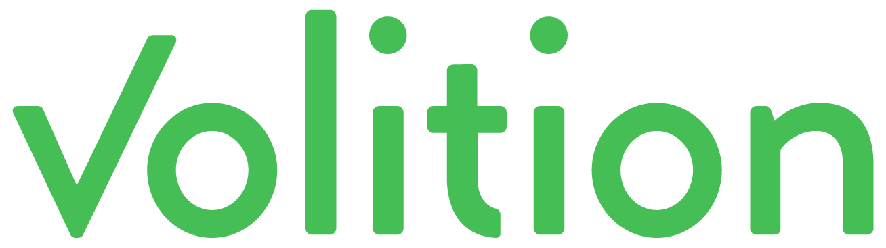

### The faculty or power of using one's will.

---

Volition is more than a todo list. It’s a framework for becoming more effective. It encourages you to be intentional in planning your day and reflecting on the decisions you've made. Read about [the philosophy behind Volition](https://usevolition.com/philosophy "Philosophy behind Volition") to learn more.

## Self-Hosting Volition
#### We believe users should control their own data
New web applications and software products seem to be more ephemeral than ever. This is the reason Volition's users have the option to self-host our software. If Volition helps you as much as it has helped us, we want you to rest easy knowing you'll have it forever. Refer to our [self-hosting guidelines](SELFHOST.md "Volition self hosting guidelines") for more details on deploying and keeping your application updated.

## Contributing to Volition
Volition will always be [MIT-licened](LICENSE.md "Volition MIT-License") open source software. We welcome all contributions. If you find a bug, feel free to fork Volition and submit a PR. We expect all Volition contributors to abide by the terms of our [code of conduct](CONDUCT.md "Volition code of conduct").

#### © 2018 Volition
